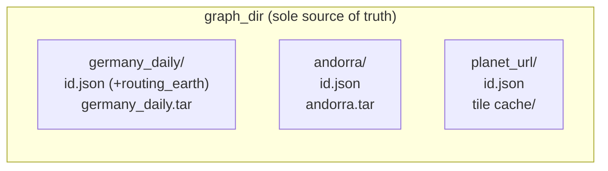
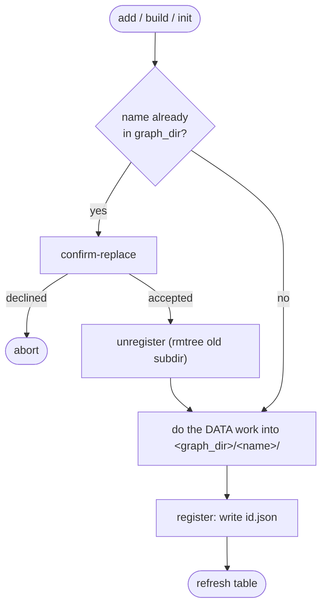
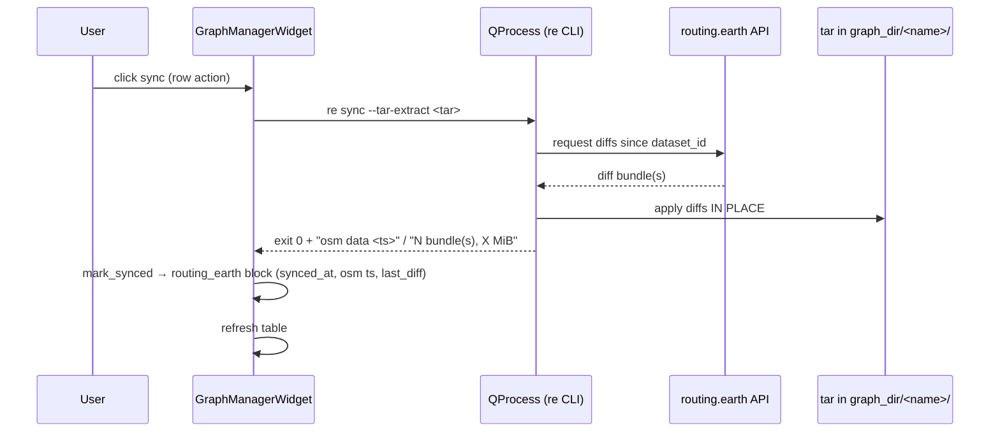

# Graph storage & routing.earth sync — how it works

The graphs table stores local graphs and routing.earth packages the same way:
**one self-contained subdir per graph inside `graph_dir`.** No metadata/data
split, no sidecar, no migration (the earlier registry design was reverted).

## The model

`graph_dir` (user-relocatable; default `<profile>/valhalla/graph_dir`) is the
**single source of truth**. A graph is `<graph_dir>/<name>/` containing:

- `id.json` — the valhalla config overlay (absolute `tile_extract`/`tile_dir`/
  `tile_url`, all pointing *inside this dir*) plus an **optional `routing_earth`
  block**. Block present ⇒ routing.earth package; absent ⇒ plain local graph.
- the data itself — the tar / loose tiles / tile cache.

`routing_earth` block = `scope`, `cadence`, `synced_at`, `osm_data_timestamp`,
`last_diff`, `behind`, `latest_osm`. Authoritative identity (`dataset_id`,
scope, cadence) is read from the tar's `.routing-earth.json` member
(`read_tar_state`, stdlib tarfile, cheap — the member sits behind `index.bin`);
the block is the fallback for display when the tar is missing.

**Changing `graph_dir`** only re-scans — graphs are never moved. Old graphs stay
in the old dir and reappear if the setting points back.

## Add paths — everything lands inside graph_dir

| Source | DATA work | Managed-tar handling |
|---|---|---|
| **From Tar** | `shutil.move` the tar into `<graph_dir>/<stem>/` | a *managed* RE tar is **refused** → redirect to Update from routing.earth |
| **From URL** | `mkdir` cache dir, tiles fetched on demand | n/a |
| **From PBF** | `valhalla_build_admins` + `_tiles` into the subdir | n/a |
| **RE init** | `re` CLI seeds a fresh tar in the subdir | must produce a managed extract |
| **RE adopt** | `shutil.move` an existing managed tar into the subdir | non-managed tar rejected |
| **RE sync** | `re` CLI rewrites the tar in place | requires the managed tar present |

Replace is safe: the confirm prompt `unregister`s the old subdir (data and all)
before the new data is written, so no stale tiles mix in and nothing is orphaned
— **the whole class of "orphaned data on replace" is gone** because data never
lives outside the subdir.

## RE sync / status — subprocess, tar mutated in place

All RE ops shell out to `python3 -m routing_earth_utils.cli` (in-process import
is impossible — the plugin's own package is named `valhalla` and shadows
pyvalhalla). One shared `QProcess`, one op at a time.

- **`re status`** is git-diff style: exit `0` = current, `2` = behind. Writes
  only the block (`behind`/`latest_osm`), never data.
- The plugin **never writes the tar itself** — routing-earth-utils owns it.
  Timestamps/sizes in the table are regex-scraped from the CLI log.

## Consumption

Selecting a graph in the dock's RouterWidget loads `<graph_dir>/<name>/id.json`,
**pops the `routing_earth` block** (plugin metadata, not valhalla config), then
deep-merges the rest into the running `valhalla.json`.

## Follow-ups (unchanged from before)

- PBF build treats only `CrashExit` as failure; a non-zero *normal* exit still
  registers a broken graph. RE ops do this right (`exit_code != 0`).
- PBF registers a phantom `tile_extract` (`<name>.tar` never produced).
- Install routing-earth-utils from PyPI via the plugin → drop the `re_python`
  dev escape hatch.
